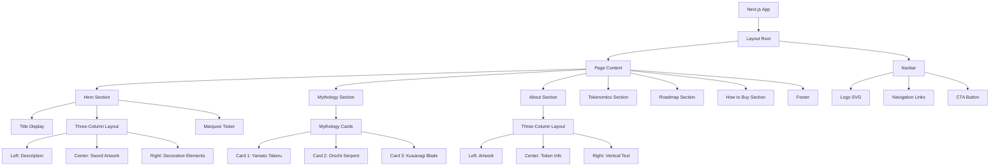

# Design Document: Kusanagi Coin Website

## Overview

The Kusanagi no Tsurugi ($NAGI) website is a production-ready Next.js application showcasing a Solana meme coin inspired by Japanese mythology. The design combines high-end museum exhibition aesthetics with retro-futurism, featuring cream/bone paper textures, brutal editorial typography mixing Japanese kanji with Latin characters, blood-red accents, bordered card panels with scan lines, and a dark punk-academic visual identity. The site presents eight key sections: Navbar, Hero, Mythology Exhibition, About, Tokenomics, Roadmap, How to Buy, and Footer.

## Architecture



## Components and Interfaces

### Component 1: Navbar

**Purpose**: Fixed navigation bar providing site-wide navigation and primary CTA for token purchase.

**Interface**:
```typescript
interface NavbarProps {
  // No props - uses internal scroll state
}

interface NavbarState {
  scrolled: boolean
}

// Component exports default function Navbar(): JSX.Element
```

**Responsibilities**:
- Display logo with Japanese sun/wave SVG icon
- Render navigation links (about, mythology, tokenomics, roadmap)
- Show CTA button with decorative asterisk symbols
- Apply scroll-based styling (backdrop blur, border on scroll)
- Smooth entrance animation on page load

**Key Features**:
- Fixed positioning with z-index 50
- Scroll event listener for dynamic styling
- Framer Motion animations for entrance
- Responsive design (flex layout)

### Component 2: Hero Section

**Purpose**: Full-viewport hero section introducing the Kusanagi token with dramatic sword artwork and mythology description.

**Interface**:
```typescript
interface HeroProps {
  // No props - static content
}

// Component exports default function Hero(): JSX.Element
```

**Responsibilities**:
- Display giant brutalist title "KUSANAGI NO TSURUGI" with red circle accent
- Render three-column layout: description, sword artwork, decorative elements
- Show contract address in bordered panel
- Display marquee ticker with Japanese/English text
- Provide "discover" button linking to About section
- Apply background texture and animations

**Key Features**:
- Full viewport height with flex layout
- Staggered animations for title, columns
- Floating animation on sword image
- Responsive grid layout (1 column mobile, 3 columns desktop)
- Numbered indicators (①②③) for slide navigation

### Component 3: MarqueeTicker

**Purpose**: Horizontal scrolling ticker displaying alternating Japanese/English text with decorative symbols.

**Interface**:
```typescript
interface MarqueeTickerProps {
  // No props - static content
}

// Component exports default function MarqueeTicker(): JSX.Element
```

**Responsibilities**:
- Render horizontally scrolling text
- Alternate between Japanese and English text
- Display decorative symbols (✦)
- Apply appropriate font families (serif for Japanese, mono for English)
- Color crimson symbols differently

**Key Features**:
- CSS animation (marquee keyframe)
- Duplicated items for seamless loop
- Conditional font family based on character detection
- Border top/bottom for visual separation

### Component 4: Mythology Section

**Purpose**: Exhibition-style showcase of three Kusanagi-related legends with interactive card selection.

**Interface**:
```typescript
interface MythologyProps {
  // No props - manages internal state
}

interface MythologyState {
  active: string // 'M1' | 'M2' | 'M3'
}

interface Myth {
  id: string
  kanji: string
  name: string
  nameJp: string
  tag: string
  description: string
  imagePath: string | null
  dark?: boolean
  featured?: boolean
}

// Component exports default function Mythology(): JSX.Element
```

**Responsibilities**:
- Manage active card state
- Render three mythology cards in grid layout
- Pass myth data and active state to MythologyCard component
- Handle card click events to update active state
- Display section header with Japanese subtitle

**Key Features**:
- Three-card grid layout
- State management for active card
- Responsive design (1 column mobile, 3 columns desktop)
- Section header with bilingual labels

### Component 5: MythologyCard

**Purpose**: Individual exhibition card displaying mythology information with dark/light theme variants.

**Interface**:
```typescript
interface MythologyCardProps {
  myth: Myth
  isActive: boolean
  onClick: () => void
}

interface Myth {
  id: string
  kanji: string
  name: string
  nameJp: string
  tag: string
  description: string
  imagePath: string | null
  dark?: boolean
  featured?: boolean
}

// Component exports default function MythologyCard(props: MythologyCardProps): JSX.Element
```

**Responsibilities**:
- Display card header with counter label and kanji
- Render image or symbolic SVG (for serpent card)
- Show name and tag at bottom
- Expand description on active state
- Apply dark theme styling for featured card
- Render decorative corner border marks
- Apply scanlines effect on dark cards

**Key Features**:
- Conditional dark/light theming
- Animated description expansion
- SVG serpent symbol for Orochi card
- Decorative corner marks (crimson borders)
- Hover scale animation
- Framer Motion layout animation

### Component 6: About Section

**Purpose**: Three-column layout presenting token information, artwork, and vertical kanji text.

**Interface**:
```typescript
interface AboutProps {
  // No props - static content
}

// Component exports default function About(): JSX.Element
```

**Responsibilities**:
- Render three-column grid layout
- Display large artwork panel on left
- Show token name and info in center
- Render vertical kanji text on right
- Apply red stamp overlay on artwork
- Display decorative retro-wave sun circle
- Show token statistics and features

**Key Features**:
- Three-column responsive grid
- Bordered panels with sepia filter on images
- Red stamp overlay with rotation
- Vertical text writing mode
- Decorative sun circle with concentric rings

### Component 7: Tokenomics Section

**Purpose**: Display token distribution, supply information, and allocation breakdown.

**Interface**:
```typescript
interface TokenomicsProps {
  // No props - static content
}

interface TokenInfo {
  label: string
  value: string
  percentage?: number
  color?: string
}

// Component exports default function Tokenomics(): JSX.Element
```

**Responsibilities**:
- Display total supply and key metrics
- Render allocation breakdown with visual indicators
- Show distribution percentages
- Apply color coding to allocation categories
- Provide clear typography hierarchy

**Key Features**:
- Grid layout for metrics
- Visual allocation bars or pie chart
- Color-coded categories
- Responsive design

### Component 8: Roadmap Section

**Purpose**: Timeline visualization of project milestones and development phases.

**Interface**:
```typescript
interface RoadmapProps {
  // No props - static content
}

interface Milestone {
  phase: string
  title: string
  description: string
  items: string[]
  completed?: boolean
}

// Component exports default function Roadmap(): JSX.Element
```

**Responsibilities**:
- Display timeline of project phases
- Show milestone descriptions and items
- Indicate completion status
- Apply visual styling for past/future phases
- Render vertical or horizontal timeline

**Key Features**:
- Timeline visualization
- Phase indicators
- Responsive layout
- Status indicators (completed/upcoming)

### Component 9: How to Buy Section

**Purpose**: Step-by-step guide for purchasing $NAGI tokens on Solana.

**Interface**:
```typescript
interface HowToBuyProps {
  // No props - static content
}

interface Step {
  number: number
  title: string
  description: string
  action?: string
  link?: string
}

// Component exports default function HowToBuy(): JSX.Element
```

**Responsibilities**:
- Display numbered steps for token purchase
- Show wallet setup instructions
- Provide DEX links and trading information
- Include security warnings and disclaimers
- Render clear call-to-action buttons

**Key Features**:
- Numbered step layout
- Clear typography hierarchy
- CTA buttons with links
- Responsive design

### Component 10: Footer

**Purpose**: Site footer with links, social media, and legal information.

**Interface**:
```typescript
interface FooterProps {
  // No props - static content
}

interface FooterLink {
  label: string
  href: string
  external?: boolean
}

// Component exports default function Footer(): JSX.Element
```

**Responsibilities**:
- Display footer navigation links
- Show social media links
- Render copyright and legal text
- Provide contact information
- Apply consistent styling with site design

**Key Features**:
- Multi-column layout
- Social media icons
- Legal disclaimers
- Responsive design

## Data Models

### TokenInfo Model

```typescript
interface TokenInfo {
  name: string                    // "Kusanagi no Tsurugi"
  symbol: string                  // "$NAGI"
  contractAddress: string         // Solana contract address
  decimals: number                // Token decimals (typically 6)
  totalSupply: string             // Total supply in base units
  circulatingSupply: string       // Currently circulating supply
  description: string             // Token description
  website: string                 // Official website URL
  twitter: string                 // Twitter handle
  discord: string                 // Discord server link
  telegram: string                // Telegram group link
}
```

### MythologyData Model

```typescript
interface Myth {
  id: string                      // Unique identifier (M1, M2, M3)
  kanji: string                   // Japanese character
  name: string                    // English name
  nameJp: string                  // Japanese name
  tag: string                     // English translation tag
  description: string             // Detailed description
  imagePath: string | null        // Path to image or null for SVG
  dark: boolean                   // Dark theme flag
  featured: boolean               // Featured/active flag
}
```

### Tokenomics Model

```typescript
interface AllocationItem {
  label: string                   // Allocation category
  percentage: number              // Percentage of total
  amount: string                  // Token amount
  color: string                   // Tailwind color class
  description: string             // Category description
}

interface Tokenomics {
  totalSupply: string             // Total token supply
  allocations: AllocationItem[]   // Allocation breakdown
  burnRate?: string               // Annual burn rate if applicable
  stakingRewards?: string         // Staking reward info
}
```

### Roadmap Model

```typescript
interface Milestone {
  phase: string                   // Phase identifier (Q1 2024, etc.)
  title: string                   // Phase title
  description: string             // Phase description
  items: string[]                 // List of deliverables
  completed: boolean              // Completion status
  date?: string                   // Target or completion date
}

interface Roadmap {
  milestones: Milestone[]         // Array of project milestones
  currentPhase: string            // Current active phase
}
```

## Algorithmic Pseudocode

### Main Page Rendering Algorithm

```typescript
ALGORITHM renderMainPage(tokenData: TokenInfo, mythologyData: Myth[])
INPUT: tokenData (TokenInfo), mythologyData (Myth[])
OUTPUT: rendered JSX page

BEGIN
  // Initialize page state
  state ← {
    scrollPosition: 0,
    activeMythCard: 'M2',
    navbarScrolled: false
  }
  
  // Setup scroll event listener
  ATTACH scrollListener TO window
  
  // Render layout structure
  layout ← (
    <RootLayout>
      <Navbar scrolled={state.navbarScrolled} />
      <Hero tokenData={tokenData} />
      <Mythology myths={mythologyData} active={state.activeMythCard} />
      <About tokenData={tokenData} />
      <Tokenomics />
      <Roadmap />
      <HowToBuy />
      <Footer />
    </RootLayout>
  )
  
  RETURN layout
END
```

**Preconditions**:
- tokenData is valid and complete
- mythologyData contains exactly 3 myth objects
- All required images are available in public directory

**Postconditions**:
- Page renders with all sections visible
- Scroll listeners are attached
- Animations are initialized

**Loop Invariants**: N/A (no loops in main algorithm)

### Scroll Event Handler Algorithm

```typescript
ALGORITHM handleScrollEvent(event: ScrollEvent)
INPUT: event (ScrollEvent from window)
OUTPUT: updated navbar state

BEGIN
  currentScrollY ← window.scrollY
  
  // Determine if navbar should show background
  IF currentScrollY > 20 THEN
    state.navbarScrolled ← true
    APPLY backdrop-blur and border styling
  ELSE
    state.navbarScrolled ← false
    REMOVE backdrop-blur and border styling
  END IF
  
  // Trigger re-render with new state
  updateState(state)
END
```

**Preconditions**:
- Scroll event listener is attached
- State management system is initialized

**Postconditions**:
- Navbar styling updated based on scroll position
- Component re-renders with new state

**Loop Invariants**: N/A

### Mythology Card Selection Algorithm

```typescript
ALGORITHM selectMythologyCard(cardId: string, myths: Myth[])
INPUT: cardId (string), myths (Myth[])
OUTPUT: updated active card state

BEGIN
  // Validate card ID
  selectedMyth ← FIND myth IN myths WHERE myth.id = cardId
  
  IF selectedMyth = NULL THEN
    RETURN error("Invalid card ID")
  END IF
  
  // Update active state
  state.activeMythCard ← cardId
  
  // Trigger animation
  ANIMATE cardExpansion(selectedMyth)
  
  // Update description visibility
  FOR each myth IN myths DO
    IF myth.id = cardId THEN
      SHOW myth.description WITH fadeIn animation
    ELSE
      HIDE myth.description WITH fadeOut animation
    END IF
  END FOR
  
  RETURN state
END
```

**Preconditions**:
- cardId is a valid string
- myths array contains at least 3 items
- Animation library (Framer Motion) is initialized

**Postconditions**:
- Active card state updated
- Description animations triggered
- UI reflects new active card

**Loop Invariants**:
- All myths remain in array
- Only one myth is active at a time

## Key Functions with Formal Specifications

### Function 1: useScrollState()

```typescript
function useScrollState(): [boolean, () => void]
```

**Purpose**: Custom React hook managing navbar scroll state.

**Preconditions**:
- Hook is called within React component
- Window object is available (client-side only)

**Postconditions**:
- Returns tuple: [scrolled boolean, cleanup function]
- Scroll event listener is attached to window
- Cleanup function removes listener on unmount

**Implementation**:
```typescript
export function useScrollState(): [boolean, () => void] {
  const [scrolled, setScrolled] = useState(false)
  
  useEffect(() => {
    const handleScroll = () => {
      setScrolled(window.scrollY > 20)
    }
    
    window.addEventListener('scroll', handleScroll)
    
    return () => {
      window.removeEventListener('scroll', handleScroll)
    }
  }, [])
  
  return [scrolled, () => setScrolled(false)]
}
```

### Function 2: getMythologyData()

```typescript
function getMythologyData(): Myth[]
```

**Purpose**: Retrieve mythology data for exhibition cards.

**Preconditions**:
- Data source is available (hardcoded or API)
- All required fields are present

**Postconditions**:
- Returns array of exactly 3 Myth objects
- All myths have valid id, name, description fields
- One myth has dark=true and featured=true

**Implementation**:
```typescript
export function getMythologyData(): Myth[] {
  return [
    {
      id: 'M1',
      kanji: '武',
      name: 'YAMATO TAKERU',
      nameJp: '日本武尊',
      tag: '(HERO PRINCE)',
      description: 'Son of Emperor Keikō, the legendary warrior who received Kusanagi from his aunt Yamato-hime and used it to defeat enemies by cutting the grass.',
      imagePath: '/images/yamato-takeru.png',
      dark: false,
      featured: false,
    },
    {
      id: 'M2',
      kanji: '蛇',
      name: 'YAMATA NO OROCHI',
      nameJp: '八岐大蛇',
      tag: '(EIGHT-HEADED SERPENT)',
      description: 'Yamata no Orochi (八岐大蛇) — a fearsome serpent deity of Japanese mythology. Eight heads, eight tails. Kusanagi was found within its body by the storm god Susanoo.',
      imagePath: null,
      dark: true,
      featured: true,
    },
    {
      id: 'M3',
      kanji: '剣',
      name: 'KUSANAGI NO TSURUGI',
      nameJp: '草薙の剣',
      tag: '(GRASS-CUTTING SWORD)',
      description: 'One of the three Imperial Treasures of Japan. A legendary sword that cuts the wind itself. Now minted as $NAGI on Solana.',
      imagePath: '/images/kusanagi-sword.png',
      dark: false,
      featured: false,
    },
  ]
}
```

### Function 3: formatTokenAddress()

```typescript
function formatTokenAddress(address: string, displayLength?: number): string
```

**Purpose**: Format Solana token address for display with truncation.

**Preconditions**:
- address is a valid Solana address string (44 characters)
- displayLength is optional, defaults to 8

**Postconditions**:
- Returns formatted string: "XXXX...XXXX"
- First displayLength/2 and last displayLength/2 characters shown
- Middle replaced with "..."

**Implementation**:
```typescript
export function formatTokenAddress(address: string, displayLength: number = 8): string {
  if (address.length < displayLength) {
    return address
  }
  
  const half = displayLength / 2
  return `${address.slice(0, half)}...${address.slice(-half)}`
}
```

### Function 4: isScrolledPast()

```typescript
function isScrolledPast(elementId: string): boolean
```

**Purpose**: Determine if user has scrolled past a specific element.

**Preconditions**:
- elementId corresponds to an existing DOM element
- Element has id attribute matching elementId

**Postconditions**:
- Returns true if window.scrollY > element.offsetTop
- Returns false otherwise
- No side effects

**Implementation**:
```typescript
export function isScrolledPast(elementId: string): boolean {
  const element = document.getElementById(elementId)
  if (!element) return false
  
  return window.scrollY > element.offsetTop
}
```

## Example Usage

### Hero Section Integration

```typescript
import Hero from '@/components/sections/Hero'
import { getMythologyData } from '@/lib/constants'

export default function HomePage() {
  const mythologyData = getMythologyData()
  
  return (
    <main>
      <Hero />
      {/* Other sections */}
    </main>
  )
}
```

### Mythology Card Selection

```typescript
'use client'
import { useState } from 'react'
import MythologyCard from '@/components/ui/MythologyCard'
import { getMythologyData } from '@/lib/constants'

export default function MythologySection() {
  const [active, setActive] = useState('M2')
  const myths = getMythologyData()
  
  return (
    <div className="grid grid-cols-3 gap-4">
      {myths.map((myth) => (
        <MythologyCard
          key={myth.id}
          myth={myth}
          isActive={active === myth.id}
          onClick={() => setActive(myth.id)}
        />
      ))}
    </div>
  )
}
```

### Navbar with Scroll Detection

```typescript
'use client'
import { useScrollState } from '@/lib/hooks'
import Navbar from '@/components/layout/Navbar'

export default function RootLayout() {
  const [scrolled] = useScrollState()
  
  return (
    <html>
      <body>
        <Navbar scrolled={scrolled} />
        {/* Page content */}
      </body>
    </html>
  )
}
```

## Correctness Properties

*A property is a characteristic or behavior that should hold true across all valid executions of a system—essentially, a formal statement about what the system should do. Properties serve as the bridge between human-readable specifications and machine-verifiable correctness guarantees.*

### Property 1: Navbar Scroll State Consistency

For all scroll positions Y, if Y > 20, then navbar.scrolled === true; if Y ≤ 20, then navbar.scrolled === false.

**Validates: Requirements 1.5, 1.6, 11.2, 11.3**

### Property 2: Exactly One Active Mythology Card

For all mythology card selections, exactly one card has isActive === true at any given time.

**Validates: Requirements 4.2, 5.2, 5.3, 24.1, 24.2**

### Property 3: Token Address Format Validity

For all valid token addresses (44 characters), the formatted address follows the pattern: first 4 characters + "..." + last 4 characters.

**Validates: Requirements 12.2, 25.2**

### Property 4: All Sections Render Without Errors

For all sections (Hero, Mythology, About, Tokenomics, Roadmap, HowToBuy, Footer), rendering produces valid JSX with no console errors.

**Validates: Requirements 2.1, 4.1, 6.1, 7.1, 8.1, 9.1, 10.1**

### Property 5: Mythology Card Description Visibility

For all mythology cards, when isActive === true, the description is visible; when isActive === false, the description is hidden.

**Validates: Requirements 5.2, 5.3**

### Property 6: Dark Card Styling Consistency

For all mythology cards with dark === true, the card applies dark background with light text; for cards with dark === false, the card applies cream background with dark text.

**Validates: Requirements 5.4, 5.6**

### Property 7: External Links Security

For all external links rendered in the system, the rel attribute contains "noopener noreferrer".

**Validates: Requirements 1.8, 10.6, 20.1**

### Property 8: Responsive Layout Adaptation

For all viewport widths less than 640px, the system displays mobile layout; for widths 640-1024px, tablet layout; for widths > 1024px, desktop layout.

**Validates: Requirements 13.1, 13.2, 13.3, 13.4**

### Property 9: Marquee Ticker Language Alternation

For all items in the marquee ticker, Japanese text items alternate with English text items, with decorative symbols (✦) between them.

**Validates: Requirements 3.2, 3.3**

### Property 10: Mythology Card Count

For all mythology section renders, exactly three mythology cards are displayed (M1, M2, M3).

**Validates: Requirements 4.1, 22.1, 22.2**

### Property 11: Scroll Event Listener Lifecycle

When a component mounts, a scroll event listener is attached; when the component unmounts, the listener is removed.

**Validates: Requirements 11.1, 11.4**

### Property 12: Contract Address Validation

For all contract addresses displayed, if the address is not 44 characters, a warning indicator is displayed.

**Validates: Requirements 12.3, 25.1, 25.2**

### Property 13: Animation Performance

For all animations applied to the system, the frame rate remains at 60fps without jank or stuttering.

**Validates: Requirements 14.9, 19.7**

### Property 14: Semantic HTML Structure

For all rendered pages, semantic HTML elements (nav, section, article, footer) are used appropriately for their content.

**Validates: Requirements 18.1**

### Property 15: Font Family Application

For all body text and labels, Space Mono font is applied; for Japanese text, Noto Serif JP font is applied.

**Validates: Requirements 15.1, 15.2, 15.5**

### Property 16: Color Scheme Consistency

For all sections, the primary background color is cream (#F0EDE6), primary text color is ink (#1A1714), and accent color is crimson (#C41E3A).

**Validates: Requirements 16.1, 16.2, 16.3**

### Property 17: How to Buy Steps Ordering

For all how-to-buy steps displayed, the steps are numbered sequentially and in the correct order for purchasing tokens.

**Validates: Requirements 9.1**

### Property 18: Navbar Logo Rendering

For all navbar renders, the logo displays a Japanese sun/wave SVG icon and "$NAGI" text in Space Mono font.

**Validates: Requirements 1.2**

### Property 19: Hero Section Three-Column Layout

For all hero section renders, the layout contains exactly three columns: description, sword artwork, and decorative elements.

**Validates: Requirements 2.3**

### Property 20: Default Active Card Selection

For all mythology section initial renders, the Orochi Serpent card (M2) is set as the active card by default.

**Validates: Requirements 4.3, 24.1**

## Error Handling

### Error Scenario 1: Missing Mythology Data

**Condition**: getMythologyData() returns empty array or fewer than 3 items

**Response**: 
- Log error to console: "Mythology data incomplete"
- Render fallback UI with placeholder cards
- Display warning message to user

**Recovery**: 
- Retry data fetch after 5 seconds
- Use hardcoded fallback data
- Notify admin via error tracking service

### Error Scenario 2: Invalid Token Address

**Condition**: Token address is not 44 characters or contains invalid characters

**Response**:
- Display truncated address with warning icon
- Show tooltip: "Invalid contract address"
- Disable copy-to-clipboard functionality

**Recovery**:
- Validate address format before display
- Use placeholder address if invalid
- Log error for debugging

### Error Scenario 3: Image Load Failure

**Condition**: Image file not found or fails to load

**Response**:
- Display placeholder/fallback image
- Show subtle error indicator
- Continue rendering page

**Recovery**:
- Retry image load after 2 seconds
- Use SVG placeholder if image unavailable
- Log failed image path for debugging

### Error Scenario 4: Scroll Event Listener Attachment Failure

**Condition**: Window object unavailable or listener attachment fails

**Response**:
- Navbar remains in default state
- No scroll-based styling applied
- Page remains functional

**Recovery**:
- Graceful degradation (no scroll effects)
- Navbar always shows background
- Log error for debugging

## Testing Strategy

### Unit Testing Approach

**Framework**: Jest + React Testing Library

**Key Test Cases**:
1. Navbar renders with correct logo and links
2. Hero section displays title with correct styling
3. Mythology cards toggle active state on click
4. Token address formatting works correctly
5. Scroll state updates on window scroll
6. All sections render without errors
7. Marquee ticker displays all items
8. Footer links are valid and external

**Coverage Goals**: 80%+ line coverage, 100% component coverage

### Property-Based Testing Approach

**Library**: fast-check (JavaScript/TypeScript)

**Property Tests**:
1. Scroll position always produces consistent navbar state
2. Mythology card selection always results in exactly one active card
3. Token address formatting always produces valid output format
4. All component props combinations render without crashing

**Example Property Test**:
```typescript
import fc from 'fast-check'

test('navbar scroll state is consistent', () => {
  fc.assert(
    fc.property(fc.integer({ min: 0, max: 10000 }), (scrollY) => {
      window.scrollY = scrollY
      fireScrollEvent()
      
      const expected = scrollY > 20
      return navbar.scrolled === expected
    })
  )
})
```

### Integration Testing Approach

**Framework**: Cypress or Playwright

**Key Test Scenarios**:
1. User navigates through all sections via navbar links
2. User clicks mythology cards and sees descriptions expand
3. User scrolls and navbar styling updates
4. User clicks CTA button and navigates to DEX
5. All external links open in new tabs
6. Page loads without console errors
7. Animations play smoothly without jank
8. Responsive design works on mobile/tablet/desktop

## Performance Considerations

- **Image Optimization**: Use Next.js Image component with lazy loading
- **Font Loading**: Use next/font for optimized font delivery
- **Animation Performance**: Use CSS transforms and opacity for smooth 60fps animations
- **Code Splitting**: Lazy load sections below the fold
- **Bundle Size**: Monitor and optimize Tailwind CSS output
- **Scroll Performance**: Debounce scroll event listeners
- **Rendering**: Use React.memo for expensive components

## Security Considerations

- **XSS Prevention**: Sanitize all user-generated content (if any)
- **External Links**: Use rel="noopener noreferrer" for external links
- **Contract Address**: Validate Solana address format before display
- **Environment Variables**: Store sensitive URLs in .env.local
- **Content Security Policy**: Implement CSP headers in next.config.js
- **HTTPS Only**: Ensure all external resources use HTTPS

## Dependencies

- **Next.js 14+**: React framework with App Router
- **React 18+**: UI library
- **TypeScript**: Type safety
- **Tailwind CSS**: Utility-first CSS framework
- **Framer Motion**: Animation library
- **@solana/web3.js**: Solana blockchain interaction
- **lucide-react**: Icon library
- **clsx**: Conditional className utility
- **tailwind-merge**: Merge Tailwind classes

